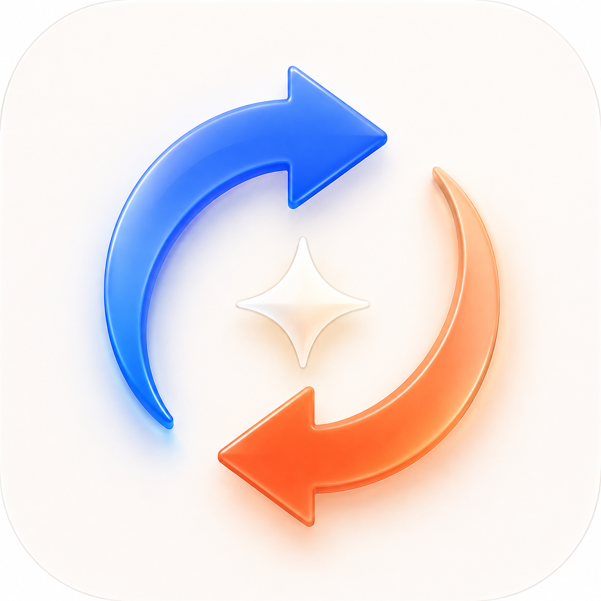

<p align="center">
  
</p>

# AI Switch

AI Switch is a native macOS app for moving quickly between Codex and Claude Code accounts. Its compact workspace has a provider sidebar, searchable account rows, five-hour/weekly usage meters, isolated OAuth profiles, and one-click activation. The menu-bar panel includes quick account switching.

**Native SwiftUI · macOS 14+ · Apple Silicon & Intel · Early beta**

An independent project, not an official OpenAI or Anthropic app.

## Download and install

[Download AI Switch 0.2.2 — universal DMG](https://github.com/praysimanjuntak/ai-switch/releases/download/v0.2.2/AI-Switch-0.2.2-macOS-universal-beta.dmg) · [SHA-256 checksum](https://github.com/praysimanjuntak/ai-switch/releases/download/v0.2.2/AI-Switch-0.2.2-macOS-universal-beta.dmg.sha256) · [Release notes](https://github.com/praysimanjuntak/ai-switch/releases/tag/v0.2.2)

1. Open the DMG and drag **AI Switch** to **Applications**.
2. Eject the image, then launch the installed app.
3. Install the Codex and/or Claude Code CLI separately if needed.
4. Use **Import** for an existing account or **Add account** to sign in with your own account.

**This beta is ad-hoc signed and is not notarized by Apple.** macOS may block a downloaded copy. Only if you trust the source, try opening the app, then use **System Settings → Privacy & Security → Open Anyway** and confirm. Managed Macs may restrict this. Do not disable Gatekeeper system-wide. See [Apple's guidance](https://support.apple.com/en-us/102445).

You do not need Xcode, Swift, or an Apple Developer membership to run the app. The download contains no saved accounts or credentials. Intel is cross-compiled; runtime testing on a physical Intel Mac and every supported macOS version is still needed.

To verify the download, place the DMG and checksum in the same folder and run:

```sh
shasum -a 256 -c AI-Switch-0.2.2-macOS-universal-beta.dmg.sha256
```

## What works

- Add Codex or Claude Code accounts through each installed CLI's browser OAuth flow.
- Import the accounts that are already active in your CLIs.
- Keep each Codex `auth.json` in its own owner-only (`0600`) profile directory.
- Keep each Claude Code profile in encrypted macOS Keychain, isolated using `CLAUDE_CONFIG_DIR`.
- Activate an account for new CLI sessions with one click.
- Read Codex limits through the local Codex app-server protocol.
- Read Claude Code's five-hour and seven-day limit data from the same authenticated usage surface used by the CLI.
- Refresh automatically every five minutes and on demand.
- See local reset clock times in account rows and the menu-bar panel; hover a meter for the full date, seconds, and time zone. Missing reset times are explicitly marked as not reported.
- Filter by provider or active accounts, search names and email addresses, and rename accounts from their actions menu.
- Use Command-F to search, Command-N to add an account, and Command-R to refresh usage.

Background refreshes use silent Keychain access and never launch Claude's `security` helper. Opening the menu shows the cached usage immediately. If macOS requires permission, automatic checks pause for that account and its row offers **Grant access**. Choose **Always Allow** in the macOS dialog to remember access for that credential. Adding, importing, and activating accounts can also request permission because these are explicit actions.

Choosing **Allow** once keeps that credential in memory for usage checks until AI Switch quits. Each refresh first attempts a silent read to pick up newer credentials; if macOS requires another approval, the previously approved credential is reused. The active Claude account is read directly from the live Keychain entry, without copying or updating saved credentials during usage refresh. Removed or rejected credentials are discarded from memory. The session cache is never written to disk. Because this local build is ad-hoc signed, replacing the app with a newly built version can require a new macOS approval.

## Requirements

- macOS 14 or newer
- `codex` and/or `claude` installed and available in a common binary location
- Building from source additionally requires Swift 6 (the Apple Command Line Tools are enough). Recipients do not need Swift or Xcode.

## Build and run

For development:

```sh
swift run AISwitch
```

To create a launchable app bundle:

```sh
./Scripts/build-app.sh
open '.build/AI Switch.app'
```

The build script also creates `.build/AI-Switch-macOS.zip` for transfer to another Mac.

Run the regression tests with `zsh Scripts/test.sh`. This exposes the Command Line Tools' Testing framework to SwiftPM's generated test runner as well as the test target.

The build is ad-hoc signed. For distribution to other Macs, sign and notarize with your Apple Developer identity.

## Create a DMG for beta testers

```sh
zsh Scripts/build-dmg.sh
```

This runs the regression tests, builds both Apple Silicon and Intel executables, and creates `dist/AI-Switch-<version>-macOS-universal-beta.dmg` plus a `.sha256` checksum. The image contains only the app, an Applications shortcut, and installation notes. The script builds a fresh bundle from an explicit file list; it never packages profile data, account backups, the source tree, or the installed app. It refuses to overwrite an existing release of the same version. Move that artifact aside or increment the version to rebuild. Temporary staging remains under `.build` for inspection.

Recipients open the DMG, drag the app to Applications, eject the image, and launch the installed copy. They must install their preferred CLIs separately. Share the release files or this public repository, **not an unfiltered copy of your local workspace**: `.build` may contain backups of this Mac's profile metadata. Build outputs and local credentials are excluded from source control.

### Distribution readiness

The default DMG is an **early beta**, not a notarized release. An ad-hoc signature verifies package integrity but does not establish a trusted developer identity, and Gatekeeper rejects this build by default. Before a normal public release, obtain a Developer ID Application certificate, sign the app with hardened runtime and a secure timestamp, submit the distribution to Apple's notary service, and staple and validate the accepted ticket. A DMG by itself does not bypass these requirements. See [Apple's notarization requirements](https://developer.apple.com/documentation/security/notarizing-macos-software-before-distribution).

Also test installation and account flows on a clean Mac, including physical Intel hardware and the oldest supported macOS version. The universal executable is cross-compiled; this is not evidence of runtime testing on every supported machine. Codex app-server and Claude's usage integration remain experimental, as noted below.

## First use

Use **Import** to bring in the account currently active in Codex or Claude Code. Use **Add account** for every additional login. After activation, start a new CLI session; an already-running Codex or Claude Code process may keep credentials cached until it exits.

AI Switch sets Codex's documented `cli_auth_credentials_store` to `file`, because deterministic `auth.json` switching is required. Before the first change it preserves the prior file as `~/.codex/config.toml.ai-switch-backup`. Live Codex credentials are backed up under `~/Library/Application Support/AI Switch/Backups` before each switch.

Profile metadata is stored at `~/Library/Application Support/AI Switch/profiles.json`. This file contains labels and cached percentages, never access tokens. Codex profile directories contain sensitive `auth.json` files and must not be synced or shared. Claude tokens remain in macOS Keychain.

## Current integration boundary

Codex app-server is marked experimental, and Claude's OAuth usage path is not a public third-party API. Both are isolated behind `UsageService`, fail without changing the active account, and can be updated independently if a provider changes its CLI contract.

## Feedback

Found a bug or have an idea? [Open an issue](https://github.com/praysimanjuntak/ai-switch/issues). Include your macOS version, Mac architecture, CLI version, and steps to reproduce. Remove account emails and other personal information from screenshots or logs. Never attach auth files, tokens, Keychain exports, or your Application Support folder.

The app icon is generated artwork created for this project with OpenAI's built-in image generation tool. Its source PNG and bundled ICNS are in `Resources/`.

## Star history

If AI Switch is useful to you, consider giving the repository a star.

[](https://www.star-history.com/#praysimanjuntak/ai-switch&Date)

The chart tracks public GitHub stars over time. A new repository may not have enough history to show a trend yet.
